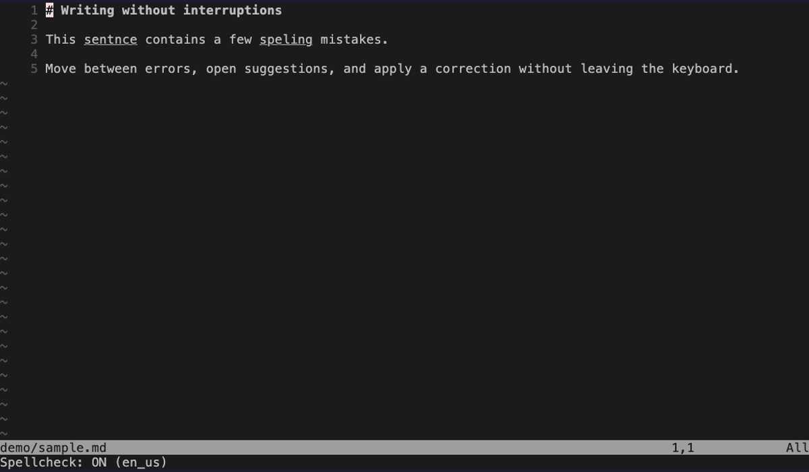

# spellcheck-mode.nvim

[](https://github.com/kungfusaini/spellcheck-mode.nvim/actions/workflows/ci.yml)
[](LICENSE)

A keyboard-first spellcheck mode for Neovim. Move between misspellings, choose a correction from a floating menu, or add a word to your dictionary without leaving Normal mode.



## Features

- Numbered spelling suggestions in a floating window
- Instant replacement without entering Insert mode
- Forward and wrap-around backward navigation
- Add the word under the cursor to your dictionary
- Buffer-local mappings that exist only while the mode is active
- Optional auto-enable by filetype
- Configurable keys, language, suggestion count, and `spelloptions`

## Requirements

- Neovim 0.8+
- A spelling dictionary for your configured language

## Installation

With [lazy.nvim](https://github.com/folke/lazy.nvim):

```lua
{
  "kungfusaini/spellcheck-mode.nvim",
  config = function()
    require("spellcheck-mode").setup()
  end,
  keys = {
    {
      "<leader>sp",
      function()
        require("spellcheck-mode").toggle_spellcheck()
      end,
      desc = "Toggle spellcheck mode",
    },
  },
}
```

You can also toggle the mode with:

```vim
:SpellcheckMode
```

## Default mappings

The mode installs these buffer-local Normal-mode mappings while it is active and removes them when disabled.

| Key | Action |
| --- | --- |
| `n` | Next spelling error |
| `p` | Previous spelling error, wrapping at the start |
| `<Space>` | Open suggestions; press a displayed number to replace the word |
| `A` | Add the word under the cursor to the dictionary |

## Configuration

```lua
require("spellcheck-mode").setup({
  keys = {
    next_error = "]s",
    prev_error = "[s",
    suggestions = "z=",
    add_to_dict = "zg",
  },
  options = {
    default_lang = "en_us",
    max_suggestions = 8,
    auto_enable_filetypes = {
      "gitcommit",
      "markdown",
      "text",
    },
    spell_options = "camel",
  },
})
```

### Defaults

```lua
{
  keys = {
    next_error = "n",
    prev_error = "p",
    suggestions = "<Space>",
    add_to_dict = "A",
  },
  options = {
    default_lang = "en_gb",
    max_suggestions = 10,
    auto_enable_filetypes = {},
    spell_options = "camel",
  },
}
```

`auto_enable_filetypes` is empty by default, so the plugin never enables spellchecking unexpectedly. When configured, matching buffers receive the same mode-local mappings automatically.

## Development

Run the test suite in headless Neovim:

```sh
nvim --headless -u tests/minimal_init.lua \
  -c "lua dofile('tests/run.lua')"
```

Regenerate the demo with [VHS](https://github.com/charmbracelet/vhs):

```sh
vhs demo/demo.tape
```

## License

[MIT](LICENSE)
